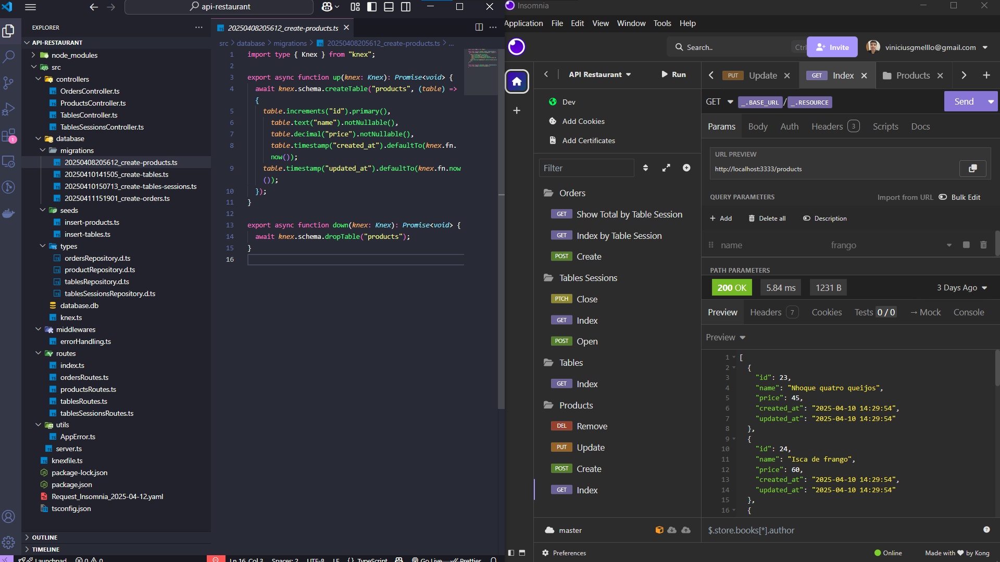
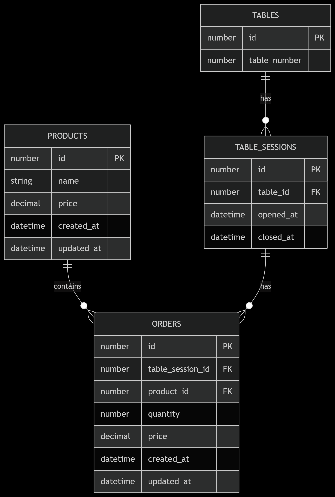

# 🍽️ API Restaurante - Sistema de Gerenciamento de Pedidos

Uma API eficiente e organizada para o controle de mesas, produtos e pedidos em restaurantes, desenvolvida com **Node.js**, **TypeScript**, **Express** e **SQLite**. Projetada com foco em boas práticas, modularidade e validação robusta de dados.

---

## 🚀 Tecnologias Utilizadas

- **Node** (v20)
- **TypeScript** (padrão ES2023)
- **Express** — Framework minimalista para APIs
- **Zod** — Validação de dados com segurança de tipos
- **Knex** — Query builder SQL flexível
- **SQLite3** — Banco de dados leve e eficiente
- **Beekeeper Studio** — Gerenciador visual de banco de dados
- **Insomnia** — Ferramenta para testes de requisições HTTP

> 

## 🚀 Estrutura do Banco de Dados

> 

---

## 🔥 Funcionalidades

### ✅ Validação e Segurança

- Validação rigorosa de dados via **Zod**
- Tipagem completa para rotas, controladores e modelos
- Regras de negócio e formatos validados automaticamente

### 🔁 Operações REST

#### Products

- `GET /products` — Lista produtos (filtro opcional por nome)
- `POST /products` — Adiciona novo produto
- `PUT /products/:id` — Atualiza dados de um produto
- `DELETE /products/:id` — Remove produto do catálogo

#### Tables

- `GET /tables` — Lista todas as mesas cadastradas

#### Tables Sessions

- `POST /tables-sessions` — Inicia uma nova sessão para a mesa
- `GET /tables-sessions` — Lista sessões ativas e finalizadas
- `PATCH /tables-sessions/:id` — Encerra uma sessão específica

#### Orders

- `POST /orders` — Adiciona itens ao pedido de uma mesa
- `GET /orders/table_session/:table_session_id` — Lista os pedidos de uma sessão
- `GET /orders/table_session/:table_session_id/total` — Retorna o valor total do pedido

---

## 🧠 Estrutura Modular

- Controladores organizados por domínio de responsabilidade
- Rotas divididas por recurso
- Middlewares reutilizáveis para validações e tratamento de erros
- Tipagens centralizadas em `types`
- Repositórios isolando regras de acesso ao banco de dados
- Classe `AppError` para tratamento uniforme de exceções
